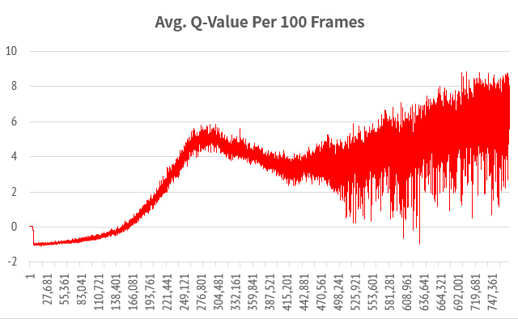
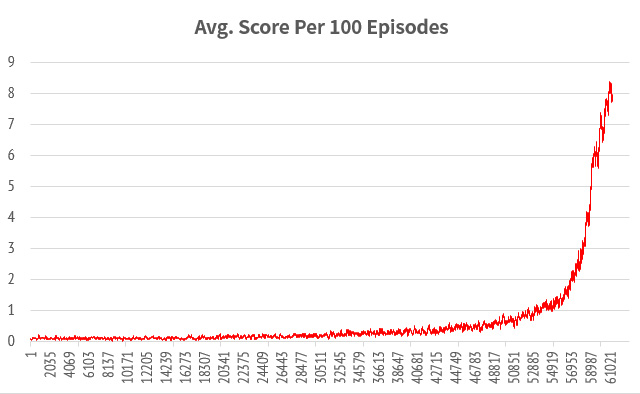

# Play Snake with Deep Q-Learning
#### by Jae-Hyeong, Sim([@Kuax-Meat](https://github.com/Kuax-Meat/))
If you have any question, suggest an issue or send an email to me. `mirelurk at kuax.org`

## 1. Introduction
This repo is an agent that plays `snake` game with Google DeepMind's DQN(NIPS 2013).

## 2. Dependencies
#### Fully compatible with
+ Windows 10 Professional 64-bit
+ Anaconda 4.2.0 64-bit (Python 3.5.x)
+ Tensorflow RC 1.0
+ Pygame
+ OpenCV

## 3. Convolutional Neural Network
Uses 3 hidden Convolutional NN layer(same as DQN Nature 2015).

## 4. How to run
simply type this command.
```
> python play.py
```

and if you want to train,
```
> python train.py
```

If you want to fresh start, [comment this line](https://github.com/Kuax-Meat/Snake-DQN/blob/master/train.py#L96-L97)(insert `#` on front of the line) and type
```
> python train.py
```

## 5. Result
Details of `Snake` for 8 hours(1,383,950 Frames and 69,989 Episodes) with Nvidia Geforce GTX 1070



## 6. Disclaimer
This repo is highly based on

+ https://github.com/devsisters/DQN-tensorflow
+ https://github.com/asrivat1/DeepLearningVideoGames

and yes, Google DeepMind's DQN. https://deepmind.com/research/dqn/

Game `Snaky` Raw Code from
https://inventwithpython.com/pygame/chapter6.html

Thanks to Sung Kim([@hunkim](https://github.com/hunkim/))

http://hunkim.github.io/ml/